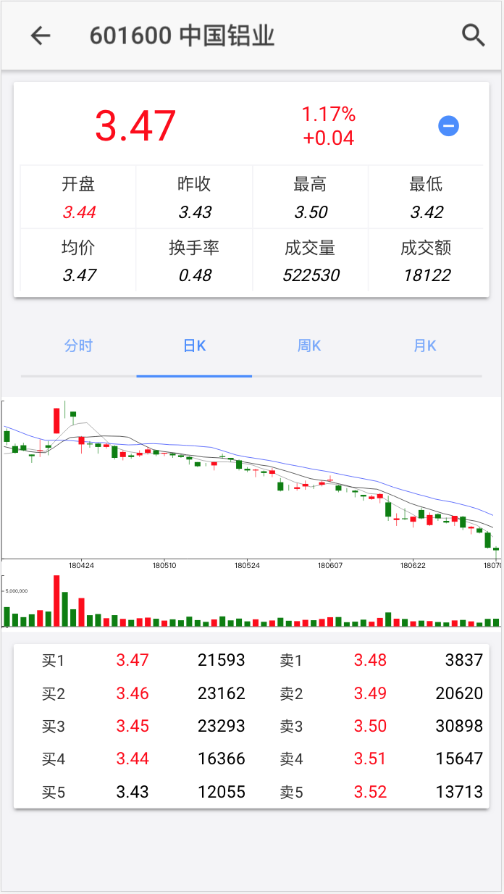
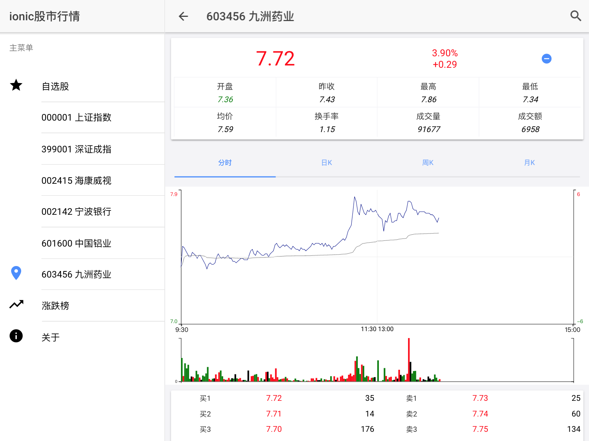

# ionic-stock-app
A chinese stock market App built with Ionic3 + Angular4 + d3. [live demo](http://jackz3.github.io/ionic-stock-app)
Pure client side app, use sina, tecent api, no server side required

### Getting Started

1. `npm install -g ionic`
2. git clone , cd repo dir
3. `npm install`
4. `ionic serve`
5. access http://localhost:8100

### Screen Shots

### TODOS

- [ ] complete charts
- [ ] auto refresh charts
- [ ] loading indicator
- [ ] stock detail finance info (F10)
- [ ] pull to refresh
- [ ] unit tests