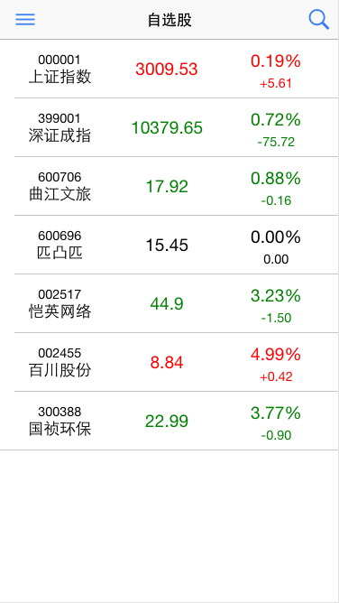
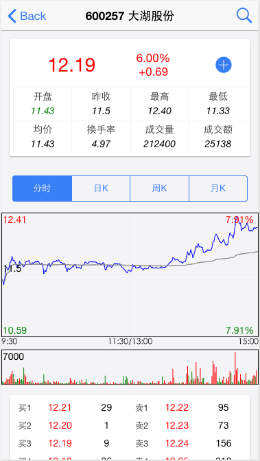
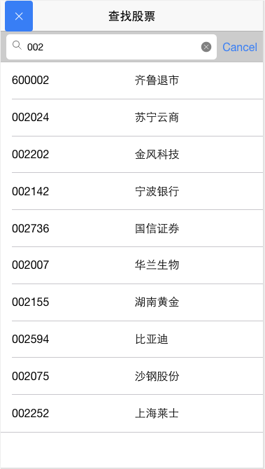

# yunguba-ionic
A chinese stock market App built with Ionic2 + Angular2 + ES2015. [live demo](http://yunguba.duapp.com)

### Getting Started

1. `npm install -g cordova ionic@beta`
2. git clone , cd repo dir
3. `npm install`
4. `ionic serve`
5. access http://localhost:8100

### Screen Shots

### TODO

- [ ] complete charts
- [ ] modify favorates
- [ ] bundle
- [x] loading indicator
- [ ] stock detail finance info (F10)
- [ ] unit tests
- [ ] pad/tablet style
- [ ] pull to refresh